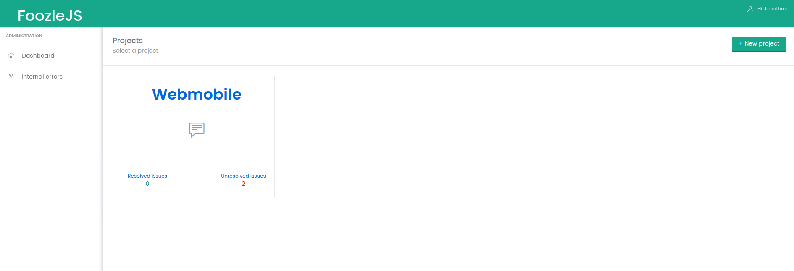

# FoozleJS front application

Django application for FoozleJS library. FoozleJS front application, it's a Django web application to managemente all errors of your projects

# How to install
* virtualenv foozlejs --no-site-package
* git clone https://github.com/jojo5716/foozlejs-front-django
* cd foozlejs-front-django && pip install -r requirements.txt
* python manage.py migrate
* python manage.py createsuperuser
* python manage.py runserver

